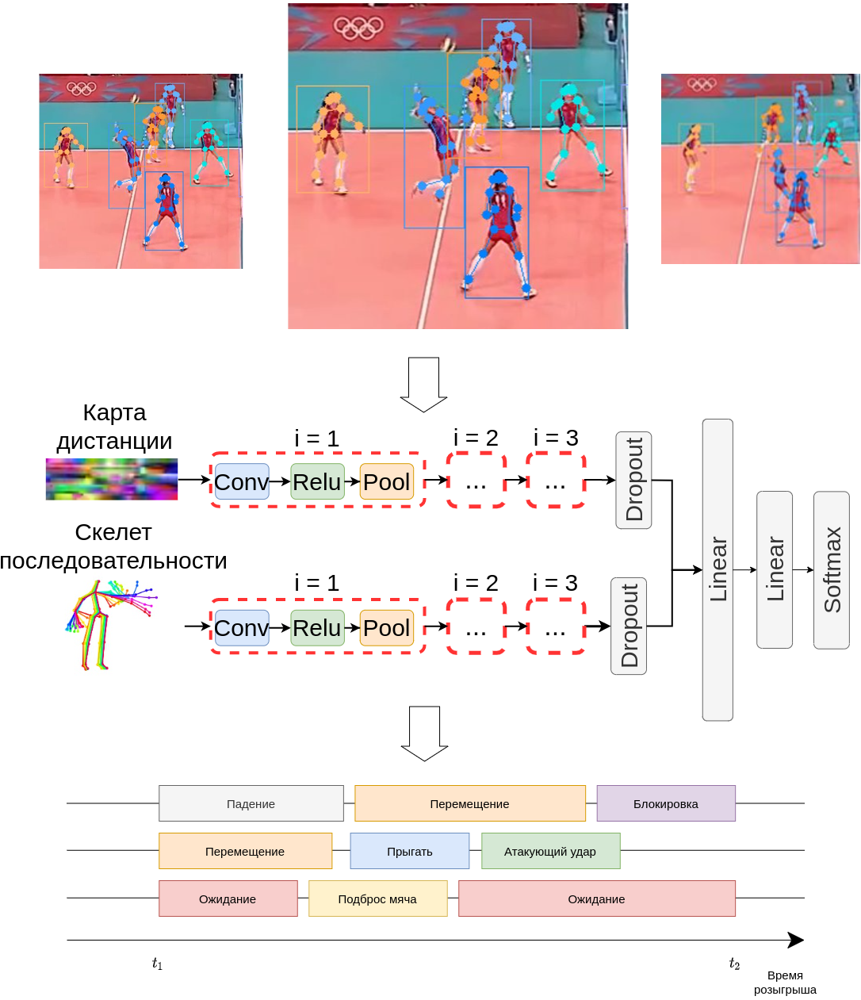

## Описание проекта
В данном репозитории представлен код проекта "**Анализ поведения группы людей по видео с использованием искусственных нейронных сетей**". 

В качестве вида спорта был выбран
волейбол. В рамках данной работы были выделены следующее требование к видео: видео должно
содержать фрагмент партии, которая проводится по официальным правилам международной
федерации волейбола.

Стоит отметить, что данное требование соответствуют общепринятой практике трансляции
волейбольных матчей. Это означает, что реализованный в рамках данной работы алгоритм должен
корректно отрабатывать на видеозаписях волейбольных матчей.

Список индивидуальных действий, которые должен распознавать алгоритм: ожидание, прием
мяча снизу, прием мяча сверху, падение, атакующий удар, блок, прыжок, стойка на месте,
передвижение.

Данный список был сформирован на базе открытого размеченного набора данных,
представленного в работе «A Hierarchical Deep Temporal Model for Group Activity Recognition».
Данный набор был выбран, так как он содержит основные простые действия, которые выполняет
игрок на протяжении матча.

## Технологический стек

1. Язык разработки: **Python 3.8.13**;
1. Система управления пакетами: **Conda**;
1. Платформа со встроенным контролем версий: **Gitlab**;
1. Система контроля версий данных:
    1. cистема контроля версий для проектов машинного обучения: **DVC**;
    1. высокопроизводительное объектное хранилище: **Minio**;
1. Шаблонизатор: **Coockiecutter**;
1. Линтер: **Flake8**;
1. Среда разработки: **VSCode**;
1. Вычислительная среда: **Jupyter Notebook**;
1. Управления жизненным циклом моделей:
    1. система для реализации жизненного цикла машинного обучения: **MLflow**;
    1. объектно-реляционная система управления базами данных: **PostgreSQL**;
    1. высокопроизводительное объектное хранилище: **Minio**;
    1. инструмент для развертывания веб-сервера: **Nginx**;
    1. программное обеспечение для автоматизации развёртывания и управления приложениями: **Docker**;
1. Обработка и анализ данных: 
    1. анализ данных: **Pandas**;
    1. визуализации данных двумерной и трёхмерной графикой:  **Matplotlib**, **Seaborn**;
    1. обработка изображений: **OpenCV**;
    1. подготовка данных: **Sklearn**;
1. Обучение и тестирование модели: **Pytorch**

## Структура проекта

    ├── data
    │   ├── external       <- Данные из внешних источников.
    │   ├── raw            <- Исходный, неизменяемый набор данных.
    │   ├── interim        <- Промежуточные данные, которые были получены из исходных.
    │   └── processed      <- Окончательный, канонический набор данных для моделирования.
    │
    ├── models             <- Обученные и сериализованные модели, результаты обучения.
    │
    ├── notebooks          <- Jupyter-ноутбуки.
    │
    ├── reports            <- Сгенерированый отчет в формате HTML, PDF, LaTeX, и др.
    │   └── figures        <- Сгенерированные графики и изображения для отчета.
    │
    ├── requirements.txt   <- Файл, описывающий список внешних зависимостей.
    │
    ├── src                <- Директория с исходным кодом.
    │   ├── __init__.py
    │   │
    │   ├── data           <- Скрипты для загрузки или генерации данных.
    │   │   └── make_dataset.py
    │   │
    │   ├── features       <- Скрипты для преобразования необработанных данных.
    │   │   └── build_features.py
    │   │
    │   ├── models         <- Скрипты для обучения и тестирования модели.
    │   │   ├── predict_model.py
    │   │   └── train_model.py
    │   │
    │   └── visualization  <- Скрипты для создания визуализаций.
    │       └── visualize.py

<small>Проект реализован на базе шаболона <a target="_blank" href="https://drivendata.github.io/cookiecutter-data-science/"> "Сookiecutter data science" </a>. #cookiecutterdatascience</small>

--------

